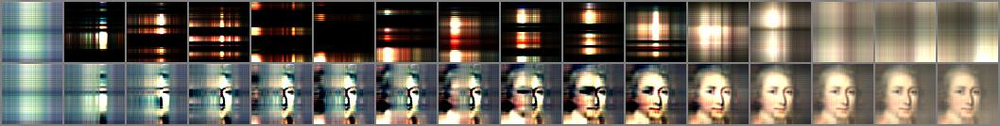
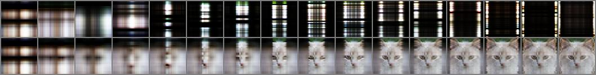
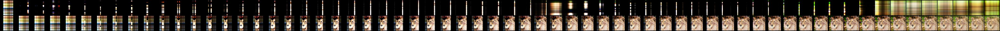
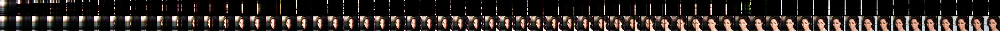

# Fast Weight Painters (FPAs)

This is the official repository containing code for the paper:

[Images as Weight Matrices: Sequential Image Generation Through Synaptic Learning Rules (ICLR 2023)](https://arxiv.org/abs/2210.06184)

### Illustrations

Iterative generation steps from left to right. *Top row: rank-1 update, bottom row: (partially) generated image*

- Generation of 64x64 images through 16 rank-1 updates (MetFaces & AFHQ-Cat)

</img>

</img>

- Generation of 64x64 images through 64 rank-1 updates (AFHQ-Wild & CelebA)

</img>

</img>

### Preliminary notes

This repository is originally forked from [lucidrains/lightweight-gan](https://github.com/lucidrains/lightweight-gan).
In addition to the implementation of our generators/FPAs, we also applied a few crucial modifications to consistently compute FID scores (see also Appendix B.4 of the paper):
* The image format can be specified via `--image_save_format`. We store generated and resized real images in the same format to compute FIDs.
* Following the standard practice, we use all real images to compute an FID.
NB: the implementation of FID computation in the current code is suboptimal: the same statistics for the real images are recomputed at every FID computation. Instead, we should compute the stastistics only for the first time (or pre-compute them), store and reuse them. However, this would also require changes in the actual function that computes the FID (we use [mseitzer/pytorch-fid](https://github.com/mseitzer/pytorch-fid) that does not support pre-computed statistics, unlike [GaParmar/clean-fid](https://github.com/GaParmar/clean-fid)). In the end, we left this as is, but ideally this should be improved.

We use the U-Net implemetation from [lucidrains/denoising-diffusion-pytorch](https://github.com/lucidrains/denoising-diffusion-pytorch) by the same author. We include the corresponding licences in `LICENSE` and in the relevant files.

We also found it useful to look into the official "Lightweight GAN" implementation ([odegeasslbc/FastGAN-pytorch](https://github.com/odegeasslbc/FastGAN-pytorch)).

For the StyleGAN2 baselines reported in the paper, we used the official StyleGAN3 implementation ([NVlabs/stylegan3](https://github.com/NVlabs/stylegan3)).

We thank all these authors for making their code publicly available.

## Requirements
The packages we used for our experiments can be found in the `requirements.txt` file.
We used python >= 3.8 and PyTorch >= 1.9.

## Generating images from pre-trained models
NB: there is no need to prepare/download any image data to generate images from a pre-trained model.

Pre-trained models can be found [here](https://drive.google.com/file/d/1mtD3wATtGJfkX6IjRPH-G1ZxOlbcpVax/view?usp=sharing).
The same folder contains example scripts for training and image generation from the corresponding model.

## Training & evaluation/generation

### Data
To train a model or to evaluate a model by computing its FID score, the data has to be downloaded in advance.
The code in this repository does not take care of downloading data: this has to be done manually.
Here are some useful links:
- AFHQ [clovaai/stargan-v2](https://github.com/clovaai/stargan-v2)
- MetFaces [NVlabs/metfaces-dataset](https://github.com/NVlabs/metfaces-dataset)
- LSUN [fyu/lsun](https://github.com/fyu/lsun)

### Training
We provide example training scripts (with the pre-trained models) [here](https://drive.google.com/file/d/1mtD3wATtGJfkX6IjRPH-G1ZxOlbcpVax/view?usp=sharing).
A typical example looks as follows:

```
## path to the data downloaded in advance
DATA="/mypath/data/celeba/img_align_celeba"

## this is where resized real images will be stored
REAL="/mypath/real_data/celeba_64"

python code/main.py \
  --num_train_steps 450_000 \
  --image_size 64 \
  --num_decoding_steps 64 \
  --data_dir ${DATA} \
  --fid_real_path ${REAL} \
  --batch_size 20 \
  --grad_cummulate_every 1 \
  --latent_dim 512 \
  --v2_input_sigmoid \
  --use_latent_to_init \
  --mini_latent_dim 8 \
  --mini_input_size 128 \
  --rnn_hidden_size 1024 \
  --num_layers 1 \
  --use_softmax \
  --out_tanh \
  --calculate_fid_every 5_000 \
  --model_type 'lstm_delta_split_v2' \
  --result_dir 'results' \
  --model_dir 'models' \
  --project_name 'just_test' \
  --use_wandb 
```

`--use_wandb` activates training monitoring using Weights & Biases. Remove it to disable it.

The model architecture can be speficied via `--model_type`.
The models used in the paper have the following names in this code:
* `base`: LightGAN baseline
* `lstm_delta`: FPA with v1 input generator
* `lstm_delta_unet`: U-Net extension of the model above
* `lstm_delta_split_v2`: FPA with v2 input generator (the main FPA architecture)
* `lstm_delta_split_v2_unet`: U-Net extension of the model above

Other models that are not reported in the paper may not be well tested.

### Evaluation
To evaluate a trained model, add the following flags to the training script (and remove `--use_wandb`):
```
  --eval_fid \
  --load_from 1 \
  --image_save_format "jpg" \
  --calculate_fid_num_images 50_000 \
```

* `--load_from 1` evaluates the best checkpoint. If this is set to `0`, the latest checkpoint is evaluated.
* `--image_save_format` should be adapted depending on the format in which the resized real images are stored (we used jpg for all datasets; again see Appendix B.4 for more details).

### Generation
Similarly, to generate images from a trained model, add the following flags to the training script (and remove `--use_wandb`):
```
  --generate \
  --load_from 1 \
  --num_image_tiles 64 \
  --generate_types 'ema' \
```

### Training U-Net models
To train an FPA/U-Net model using a pre-trained FPA checkpoint, add the following flags:
```
  --load_pre_trained path_to_my_fpa/models/default/model_1.pt \
  --frozen_base \
  --stop_grad_unet \
  --reset_g_optimizer \
  --unet_tanh \
  --ema_only_unet \
```
and modify `--model_type` to specify the corresponding FPA/U-Net architecture.

* `--load_pre_trained` has to be adapted to the path of a pre-trained FPA model.
* `--unet_tanh` can be removed if the pre-trained FPA is trained without `--out_tanh` option.
* The version above initializes the discriminator from the pre-trained parameters. `--load_only_g` and `--reset_d_optimizer` should be further added to train the discriminator from scratch. In general, we only observed minor differences between these two options in term of the final FID.

## Links
* Fast Weight Painters are Fast Weight Programmers (FWPs) applied to image generation. See also our previous works on FWPs: 
    * [Linear Transformers are Secretly Fast Weight Programmers (ICML 2021)](https://arxiv.org/abs/2102.11174)
    * [Going Beyond Linear Transformers with Recurrent Fast Weight Programmers (NeurIPS 2021)](https://arxiv.org/abs/2106.06295)
    * [A Modern Self-Referential Weight Matrix That Learns to Modify Itself (ICML 2022)](https://arxiv.org/abs/2202.05780)
    * [Neural Differential Equations for Learning to Program Neural Nets Through Continuous Learning Rules (NeurIPS 2022)](https://arxiv.org/abs/2206.01649)
* [Jürgen Schmidhuber's AI blog post on Fast Weight Programmers (March 26, 2021)](https://people.idsia.ch/~juergen/fast-weight-programmer-1991-transformer.html).

## BibTex
```
@inproceedings{irie2023image,
  title={Images as Weight Matrices: Sequential Image Generation Through Synaptic Learning Rules},
  author={Kazuki Irie and J{\"u}rgen Schmidhuber},
  booktitle={Int. Conf. on Learning Representations (ICLR)},
  address = {Kigali, Rwanda}, 
  month = may,
  year={2023}
}
```
